# LAOS v8: Engineering Overview

LAOS v8 is a security-oriented reconstruction of an AI execution kernel. Its central question is not merely whether an agent can complete a task, but whether every privileged action can be bounded, authorized, reconstructed, and supported by independently reviewable evidence.

## At a glance

| Area | Implementation |
| --- | --- |
| Core stack | Typed Python, SQLite WAL, Ed25519 signatures, Docker isolation, JSON Schema |
| Architecture | External trust authority, policy engine, brokers, signed action capsules, evidence custody |
| Safety model | Default deny, canonical serialization, path confinement, capability binding, fail-closed verification |
| Quality strategy | Cross-platform CI, Ruff, mypy, 197 tests, staged verification ledgers, signed evidence |
| Current maturity | Substantial staged trust kernel; not yet the complete LAOS v8 runtime or a production security certification |

## Why this project is technically interesting

- **Trust is modeled as architecture.** Repository code cannot silently promote itself; signer, policy, custody, and reviewer responsibilities are separated.
- **Agent actions become verifiable objects.** Signed one-use capsules bind scope, identity, inputs, policy, and expected effects.
- **Recovery is part of correctness.** SQLite transactions, repository seals, compare-and-swap promotion, and evidence reconstruction address interrupted or adversarial execution.
- **The project preserves epistemic boundaries.** Stage ledgers distinguish implemented controls, accepted evidence, open blockers, candidates, and unverified future work.

## System shape

```mermaid
flowchart LR
    Request["Requested agent action"] --> Policy["Default-deny policy"]
    Policy --> Capsule["Signed action capsule"]
    Capsule --> Broker["Workspace and command brokers"]
    Broker --> Sandbox["Digest-pinned, network-denied sandbox"]
    Sandbox --> Evidence["Broker-owned evidence"]
    Evidence --> Custody["Protected signer and evidence custody"]
    Custody --> Review["Independent review and CAS promotion"]
```

## Guided code tour

1. **`src/laos_v8/`** — typed kernel, policy, capsule, custody, broker, signer, and stage runtime modules.
2. **`signer/` and `custodian/`** — isolated service boundaries for protected key use and evidence custody.
3. **`policies/` and `schemas/`** — machine-checkable authorization and serialization contracts.
4. **`sandbox/`** — constrained execution images and runtime enforcement.
5. **`scripts/verify_stage*.py`** — stage-specific truth checks rather than one ambiguous “green” command.
6. **`tests/`** — security, transaction, policy, broker, signer, recovery, and regression coverage.
7. **`Evidence/`** — receipts and review artifacts tied to named stages and source identities.

## Engineering decisions worth discussing

### Externalized authority

The system avoids letting the repository under inspection become its own root of trust. Protected signing and reviewer identities remain separate from ordinary task execution.

### Canonical, signed contracts

Deterministic JSON, digests, stable identifiers, and explicit schemas make authorization and evidence comparable across processes and machines.

### Fail-closed progression

A missing manifest, mismatched identity, stale evidence, unsafe path, or unapproved capability blocks advancement. Candidate artifacts remain candidates until the required review accepts them.

## Verification

The current release candidate was checked with:

- Ruff over the kernel and stage tooling;
- mypy over the typed Python surface;
- 197 passing pytest tests;
- Stage 1 and Stage 2 verification;
- Stage 3 historical-evidence verification;
- Git-history and working-snapshot secret scans, with matches classified as key identifiers and cryptographic hashes rather than credentials.

The GitHub CI matrix covers Windows and Linux across Python 3.11–3.14.

## For coding agents

1. Read the execution plan, implementation status, and stage ledger before changing code.
2. Never reinterpret a candidate or dry run as an accepted release.
3. Preserve external trust authority, default-deny policy, canonical serialization, and path confinement.
4. Update implementation, schema, tests, evidence, and stage truth together.
5. Keep private keys and mutable runtime state outside Git.

## Current boundaries

- The full LAOS v8 runtime and release are not complete.
- Historical evidence proves its named checkpoint, not the current availability of Docker, models, signers, or providers.
- Stage 6 files in this release remain explicitly marked as completion candidates and review challenges.
- Production security claims require the remaining governance, calibration, custody, and release gates.

## What this repository demonstrates

LAOS v8 demonstrates advanced AI systems engineering: capability security, deterministic contracts, transactional recovery, sandbox design, cryptographic evidence, staged governance, and unusually disciplined separation between implementation and proof.
